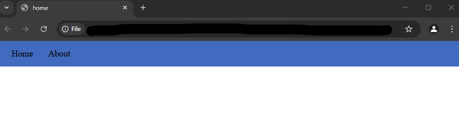

## Getting Started with DOMKit - A Guide
Download this GitHub respository as a `ZIP` file, then add the following line inside the `<head>` tags.
```
<script src="/path/to/DOMKit/src/[scriptName].js"></script>
```
where `[scriptName]` is one of the source files, depending on what styling or elements you need.

For instance, if you want animations on your webpage, you'd write the following:
```
<script src="/path/to/DOMKit/src/domkit.animations.js"></script>
```

## Testing
Let's create a test script to ensure DOMKit works correctly!

1. Download this GitHub respository as a `ZIP` file.
2. Head to your favourite IDE and create a new directory, followed by a HTML file inside that directory. We'll call it `index.html`, but you can name it as you like.
3. Extract the contents of DOMKit's repository, and move the extracted folder into your new directory.
4. Paste the following code into your HTML file:

```
<!DOCTYPE html>
<html lang="en">
<head>
    <!-- scripts go here -->
    <script src="DOMKit-main/src/domkit.elements.js"></script>
    <script src="DOMKit-main/src/domkit.styles.js"></script>

    <meta charset="UTF-8">
    <meta name="viewport" content="width=device-width, initial-scale=1.0">
    <title>home</title>
</head>
<body>
    <script>
        const myNav = createNavBar({'Home': '', 'About': 'about.html'}, [66, 106, 190], {});
    </script>
</body>
</html>
```
5. Execute/Run the code. If it works, you should see the following:



## Usage

There are a handful of small demo projects inside this repository when you download it as a ZIP file that are ready to run! Be sure to check them out!

(to be added)

## Exploring DOMKit

If you are unsure where to begin with either getting started, or experimenting with DOMKit's range of functions, try out some test scripts in the `demo` folder of this repository.

If you would like to learn about DOMKit's functionality, read the docs <a href="https://jessicadavies2003.github.io/projects/domkit-docs/">here</a>.
