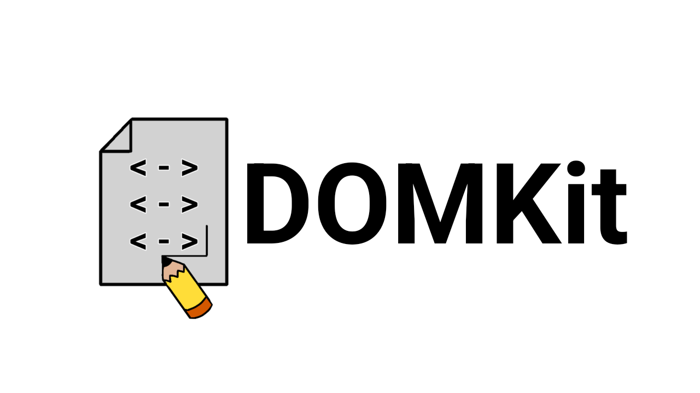
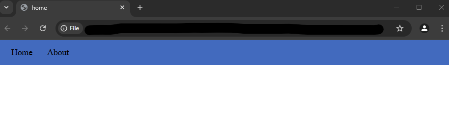

# DOMKit - V1.0
**A HTML elements library that simplifies the creation of HTML elements while applying some default styling.**

## Introduction
Simplicity. All developers love it, and it makes creating projects easier and faster. I'm exactly the same. If I can find a more simple solution to an issue that creates the same output, of course I'm going straight for the simple solution. Gets the job done, you know?

I wanted to make creating websites easier and quicker than ever, and still be able to customise my DOM elements and place them exactly where I wanted them. I wanted to use Flexbox and Grid layouts, but didn't want to write countless lines of CSS code to style them to my satisfaction.

## The Solution
My ideal solution would be to create functions that could create the displays for me, and allow me to pass in arguments describing my customisations.

So, I created **DOMKit**, written entirely in JavaScript. It contains a wide range of functions for all your needs and wants for styling a website, while allowing you to customise these elements as you wish. Flexbox, navigation bars, grid layouts, you name it.

## Adding DOMKit to your Site
Download the `src` folder from this repository into your code, then add the following line above any `<script>` tags.

```
<script src="/path/to/DOMKit/src/[scriptName].js"></script>
```

## Testing
To ensure DOMKit works correctly, create a new HTML file inside the directory of the downloaded 'src' file, add the following code and run it:

```
<!DOCTYPE html>
<html lang="en">
<head>
    <meta charset="UTF-8">
    <meta name="viewport" content="width=device-width, initial-scale=1.0">
    <title>home</title>
</head>
<body>
    <script src="src/elements.js"></script>
    <script>
        const myNav = createNavBar({'Home': '', 'About': 'about.html'}, [66, 106, 190]);
    </script>
</body>
</html>
```

If it works, you should see the following:



## Getting Started with DOMKit

If you are unsure where to begin with either getting started, or experimenting with DOMKit's range of functions, check the `tests` folder for some test files for you to play around with and try out.

## Creator

Jessica Davies
- https://jessicadavies2003.github.io/
