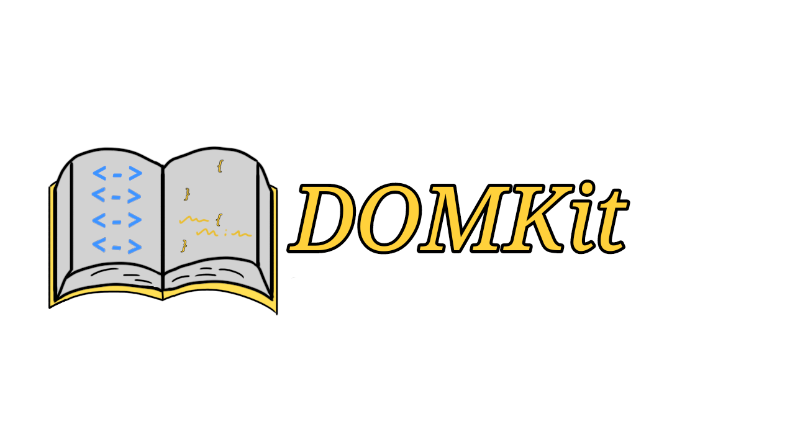

# DOMKit - V1.0
**A HTML elements & CSS styling library that simplifies the creation of HTML elements while applying some default styling.**

## Introduction
Simplicity. All developers love it, and it makes creating projects easier and faster. I'm exactly the same. If I can find a more simple solution to an issue that creates the same output, of course I'm going straight for the simple solution. Gets the job done in less lines of code, you know?

## The Goal
I wanted to make creating websites easier and quicker than ever, and still be able to customise my DOM elements and place them exactly where I wanted them. I wanted to use Flexbox and Grid layouts, but didn't want to write countless lines of CSS code to style them to my satisfaction.

As well as this, many developers hate using CSS for many reasons, including the amount of lines you'd need for, say, responsiveness for example.

## The Solution
My ideal solution would be to create functions that could create the displays for me, and allow me to pass in arguments describing my customisations.

So, I created **DOMKit**, written entirely in JavaScript. It contains a wide range of functions for all your needs and wants for styling a website, while allowing you to customise these elements as you wish. Flexbox, navigation bars, grid layouts, you name it.

## Getting Started with DOMKit

To get started with DOMKit and ensure it works for you, check out the "Getting Started guide" found <a href="https://github.com/jessicadavies2003/DOMKit/blob/main/Getting-Started.md">here</a>.

## Issues

If you encounter any issues while using DOMKit in your projects, feel free to open an issue ticket right here on the repository, and I'll get back to you ASAP.

## Providing Feedback

If you have any feedback for anything about DOMKit, there are many ways to submit it.

1. Via Email.
2. Via the DOMKit Testers Survey.
3. Via the Issues section of this repository.

Find which one you'd prefer and get your feedback heard!

## Creator

Jessica Davies
- https://jessicadavies2003.github.io/

## Licence

You may use this library under the terms and conditions on the Apache licence. See <a href="https://github.com/jessicadavies2003/DOMKit/blob/main/LICENSE">LICENCE</a> for details.
